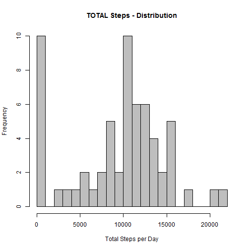
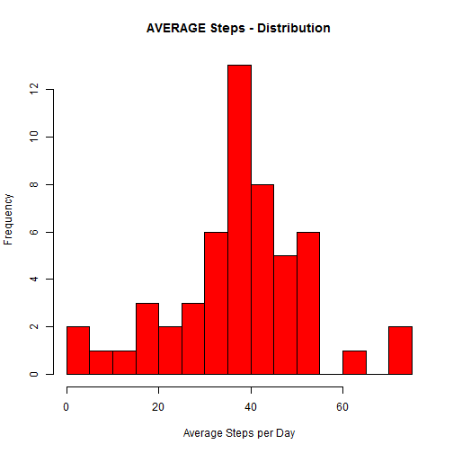
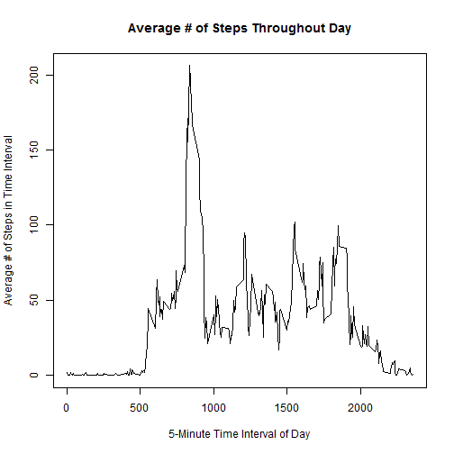
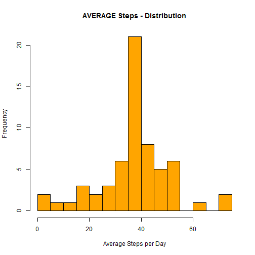
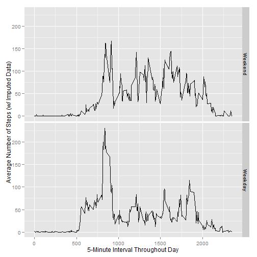

# Reproducible Research: Peer Assessment 1


## Loading and preprocessing the data
Following is the "R" code that performs this part "1" of the assignment:

```r
library(ggplot2)

# Go to my Home Directory, then grab data out of folder and read it in
setwd("C:/Users/Alan/Documents/Data Science Course (Coursera)/Reproducible Data Homework I")
aData <- read.csv("activity.csv", colClasses=c("integer", "Date", "integer"))
```

## What is mean total number of steps taken per day?
Following is the "R" code that performs this part "2" of the assignment:

```r
# Apply the "sum" function to the # of steps by date
totalSteps <- tapply(aData$steps, aData$date, sum, na.rm=T)
meanSteps <- mean(totalSteps)
medianSteps <- median(totalSteps)
```
Now post the calculated values of "mean" and "median" number of steps taken per day:

```r
meanSteps
```

```
## [1] 9354
```

```r
medianSteps
```

```
## [1] 10395
```
Finally, let's create a time series plot of the 5-minute interval vs. the Total and Average Steps per Day:

```r
# Plot Total Steps and Average Steps
hist(totalSteps, breaks=20, col="grey", xlab="Total Steps per Day", main="TOTAL Steps - Distribution")
```

 

```r
averageSteps <- tapply(aData$steps, aData$date, mean, na.rm=T)
hist(averageSteps, breaks=20, col="red", xlab="Average Steps per Day", main="AVERAGE Steps - Distribution")
```

 

## What is the average daily activity pattern?
Following is the "R" code that performs this part "3" of the assignment:

Apply the "mean" function to the steps by interval, isolate the unique intervals, then calculate the max within the dataset:

```r
# Get the average # of steps per 5-minute Interval during a typical day
intervalSteps <- tapply(aData$steps, aData$interval, mean, na.rm=T)
# Now get the labels for the 5-minute intervals
intervalTimes <- unique(aData$interval)
# Now find which interval the MAXIMUM value resides in
maxInterval <- intervalTimes[which(intervalSteps==max(intervalSteps))]
```
Post the 5-minute interval that contains the maximum number of steps:

```r
maxInterval
```

```
## [1] 835
```
Now a time series plots of the Average number of steps taken per 5-minute interval per day:

```r
par(xaxs="r",yaxs="r")
plot(intervalTimes, intervalSteps, xlab="5-Minute Time Interval of Day", ylab="Average # of Steps in Time Interval", main="Average # of Steps Throughout Day", type="l")
```

 

## Imputing missing values
Following is the "R" code that performs this part "4" of the assignment:

```r
# Calculate the number of observations in the dataset that have NA's
numComplete <- nrow(aData) - sum(complete.cases(aData))
```
Report the number of incomplete observations:

```r
numComplete
```

```
## [1] 2304
```

```r
# Populate NA's w/ the mean value for that given time interval across the dataset
imputeData <- transform(aData, steps=ifelse(is.na(steps), intervalSteps, steps))
summary(imputeData)
```

```
##      steps            date               interval   
##  Min.   :  0.0   Min.   :2012-10-01   Min.   :   0  
##  1st Qu.:  0.0   1st Qu.:2012-10-16   1st Qu.: 589  
##  Median :  0.0   Median :2012-10-31   Median :1178  
##  Mean   : 37.4   Mean   :2012-10-31   Mean   :1178  
##  3rd Qu.: 27.0   3rd Qu.:2012-11-15   3rd Qu.:1766  
##  Max.   :806.0   Max.   :2012-11-30   Max.   :2355
```

```r
totalSteps <- tapply(imputeData$steps, imputeData$date, sum, na.rm=T)
imputeStepMean <- mean(totalSteps)

imputeSteps <- tapply(imputeData$steps, imputeData$date, mean, na.rm=T)

imputeiSteps <- tapply(imputeData$steps, imputeData$date, sum, na.rm=T)
meaniSteps <- mean(imputeiSteps)
medianiSteps <- median(imputeiSteps)
```
Compare the mean and media number of steps for this "imputed" dataset vs. the original datset. First the ORIGINAL dataset:

```r
meanSteps
```

```
## [1] 9354
```

```r
medianSteps
```

```
## [1] 10395
```
...and now the IMPUTED dataset:

```r
meaniSteps
```

```
## [1] 10766
```

```r
medianiSteps
```

```
## [1] 10766
```
You can clearly see that the imputed dataset has increased the # of steps by applying the mean to the NA's. Also interesting to note that the mean and median are the same in the imputed dataset.

Now let's compare them visually in plots. First the ORIGINAL dataset:

```r
# Compare to the non-imputed dataset
#averageSteps <- tapply(aData$steps, aData$date, mean, na.rm=T)
hist(averageSteps, breaks=20, col="red", xlab="Average Steps per Day", main="AVERAGE Steps - Distribution")
```

 

...and now the IMPUTED dataset:

```r
hist(imputeSteps, breaks=20, col="orange", xlab="Average Steps per Day", main="AVERAGE Steps - Distribution")
```

 


## Are there differences in activity patterns between weekdays and weekends?
Following is the "R" code that performs this part "5" of the assignment:

```r
# Create 2 separate subsets of data
dataWE <- subset(imputeData, weekdays(date) %in% c("Saturday", "Sunday"))
dataWD <- subset(imputeData, !weekdays(date) %in% c("Saturday", "Sunday"))

# Now find/aggregate by averaging the number of steps per interval for each data subset
dataWE <- aggregate(steps ~ interval, dataWE, mean)
dataWD <- aggregate(steps ~ interval, dataWD, mean)

# Add column with label for the 2 subsets
dataWE <- cbind(dataWE, day = rep("Weekend"))
dataWD <- cbind(dataWD, day = rep("Weekday"))

# Combine the subsets and a specify the levels of the "factor"
dataAll <- rbind(dataWE, dataWD)
levels(dataAll$day) <- c("Weekend", "Weekday")

ggplot(dataAll, aes(x = interval, y = steps)) + geom_line() + facet_grid(day ~ .) + labs(x = "5-Minute Interval Throughout Day", y = "Average Number of Steps (w/ Imputed Data)")
```

 
